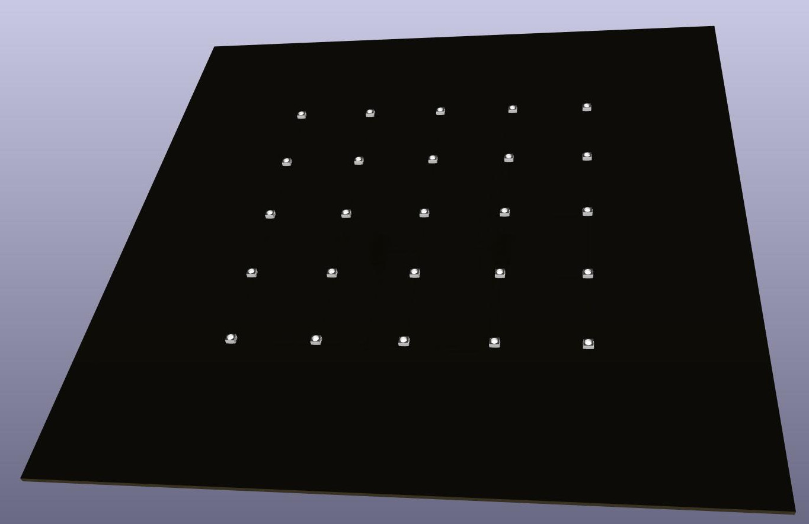
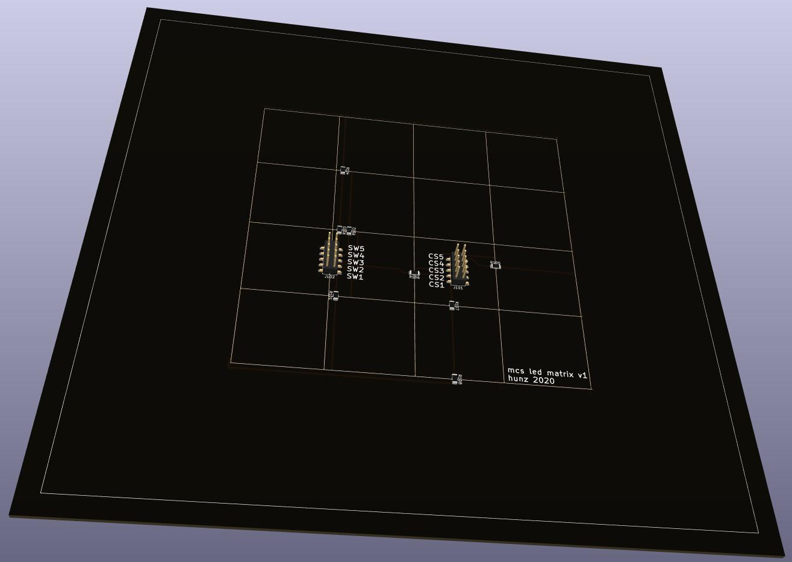
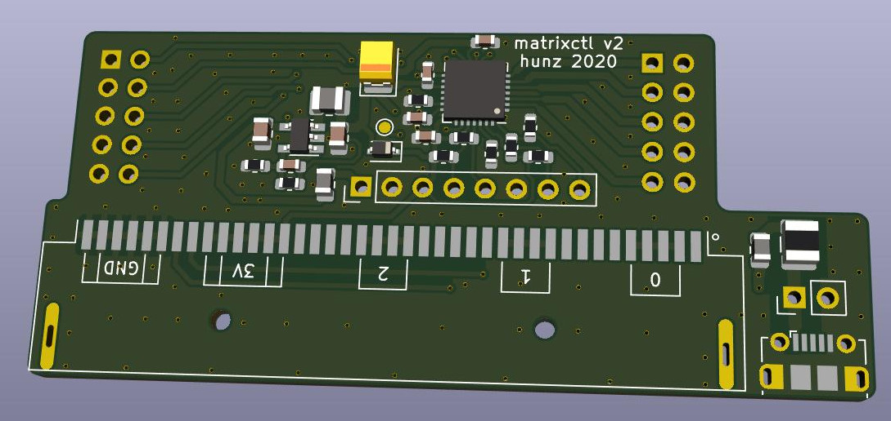

# Exposure Notifications
Printed Circuit Boards for the Covid-19 Exposure Notifications Visualizer - 
[see this for more details](https://znu.nz/exposure_notifications-en)

To remake Exposure Notifications you need to get/make four things:
- a BBC micro:bit or Calliope Mini with the [microbit-corona-scanner](https://github.com/znuh/microbit-corona-scanner) installed
- a black 23x23cm RIBBA frame from IKEA
- the printed circuit board for the LEDs - see the leds/ directory of this repository
- the printed circuit board for the LED matrix controller - **either** matrixctl-v1 **OR** matrixctl-v2
  - matrixctl-v2 includes a socket for the micro:bit and a switching voltage regulator
  - matrixctl-v1 comes without a socket for the micro:bit and has no switching voltage regulator
  - v2 is more efficient and keeps the LED matrix driver cooler when more LEDs light up - therefore I recommend using v2

The printed circuit board designs are made with a **Nightly Development Build** of [KiCAD](https://kicad-pcb.org/).
If you want to open/edit them you also need a recent Nightly Development Build. If you just want to use the PCBs unmodified you can also use the gerber-files from the gerber-subdirectories.

## LED matrix board
The LED matrix board uses Würth 150141RV73100 LEDs. These are bicolor-LEDs but only the red LED is used.
The landing pads for the LEDs have been reduced to a minimum to hide the pads underneath the LEDs. All PCB tracks are on the back side of the PCB. 1206 0-Ohms resistors are used instead of vias to cross tracks.

## matrixctl v2 board ##
The part number of the micro:bit socket is PIS-1240. The Micro-USB connector is a Molex 105017-0001. You can get these parts and all additional components from digi-key.

Following a recommendation from the IS31FL3738 datasheet the board includes a Tantalum Capacitor to avoid audible noise produced by ceramics capacitors through the [piezoelectric effect](https://product.tdk.com/en/contact/faq/31_singing_capacitors_piezoelectric_effect.pdf). Tantalum is a conflict resource. I've chosen a Kemet T495B336K010ATE450 because Kemet is a sane choice in general and their handling of the issue sounds ok.

If you do not want to use the micro:bit socket you can also connect the micro:bit or a Calliope Mini to the pin header of the PCB. You need to connect I²C (SCL and SDA), 3V and GND.
